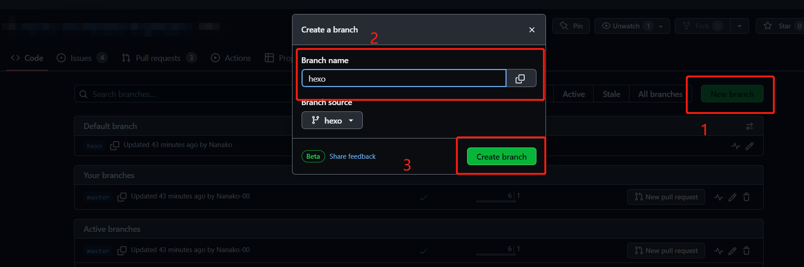
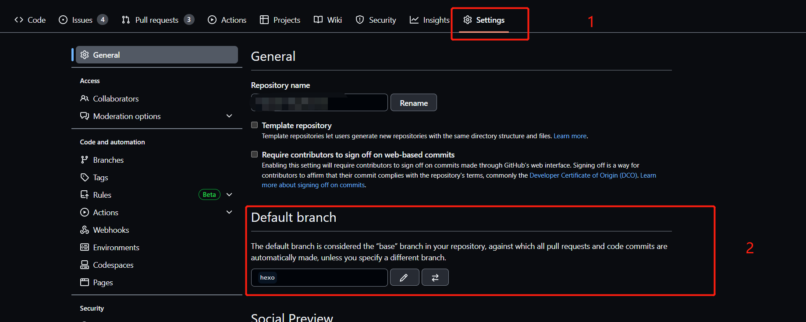

今天突然想到，如果我后续更换了设备，那我的博客不就没办法继续写了吗，因为git上是没有源码的。于是就查找资料，跟大佬学了一手 hexo 推送至 github。主要利用的还是 git 分支的特性。

## 旧电脑操作

- 登录到 github 找到自己的博客项目，新建一个 <font color=#FF9900>hexo</font> 分支，并且将其设置为默认分支。



- 在本地新建一个目录，将 hexo 分支的代码 clone 至本地（后续都称hexo项目）。
- 从<font color=#FF9900>文件夹</font>打开 hexo （编辑器有的文件看不到），删除掉除了 <font color=#FF9900>.git</font> 之外的所有文件。
- 终端进入到 hexo 下，依次执行下列命令
```shell
git add -A
git commit -m "--"
git push origin hexo
```
- 执行完你会发现 github 上的 hexo 分支已经清空了。
- <font color=#FF9900>将 hexo 的 .git 文件复制到自己的博客根目录下</font>（与themes、source同级）。（执行完这一步本地的博客就可以和hexo分支相连了）
- 进入到 themes 目录下， 删除掉里面的 .git 和 .gitignore。（包括<font color=#FF9900>各个主题下的这两个文件也都要删除</font>。否则主题下的文件推不上去）
- 回到博客根目录。继续三连
```shell
git add -A
git commit -m "--"
git push origin hexo
```
到这基本就完成了！

<font color=red>一个hexo分支用来存放网站的原始文件，一个master分支用来存放生成的静态网页。</font>

## 新电脑操作
- 先把该装的环境装好（node.js, git, hexo, sshkey配置好）
- 选好博客的目录创建文件夹
- 执行 git clone git@github.com:username/username.github.io.git blog； 将 hexo 分支的代码 clone 下来
- cd到博客里面，安装依赖 npm i
- hexo s 启动博客。正常是已经可以访问了的

## 后续提交
- 后面就可以每次将代码推送至 github 的 hexo 分支保存。
```shell
git add -A
git commit -m "--"
git push origin hexo
```
- 然后正常发布就可以
```shell
hexo clean && hexo g && hexo d
```

文章转载至：https://blog.csdn.net/weixin_44008788/article/details/108325786?spm=1001.2101.3001.6650.3&utm_medium=distribute.pc_relevant.none-task-blog-2%7Edefault%7ECTRLIST%7ERate-3-108325786-blog-109921090.235%5Ev38%5Epc_relevant_default_base&depth_1-utm_source=distribute.pc_relevant.none-task-blog-2%7Edefault%7ECTRLIST%7ERate-3-108325786-blog-109921090.235%5Ev38%5Epc_relevant_default_base&utm_relevant_index=6